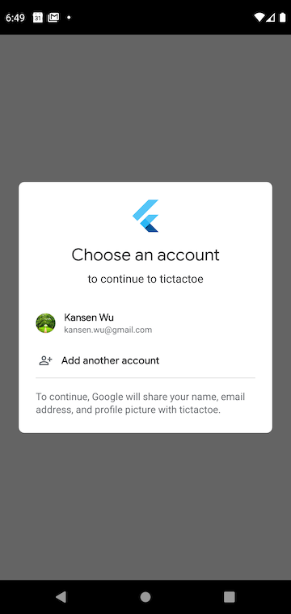

# Ting Exercise Project
### What Does This Project Do
This is a simple flutter app that provides a TicTacToe game on Android phone.
Which uses Firebase for Google Sign In and store user score information
on Firestore databse.

### Environment Setup
* Use AndroidStudio for Flutter development
* Flutter 1.22.6 and Dart 2.10.5
* User needs to use a working gmail account to signin.
* Firebase authentication using Google Sign In
* Firebase Android Setup

### App Demo

### App Download

